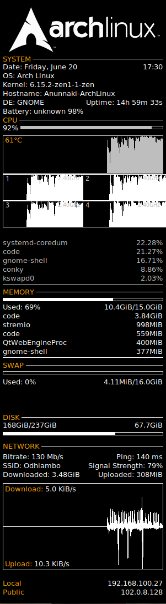
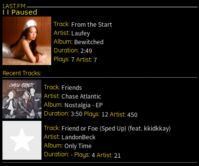

# Conky Themes & Widgets

A collection of modern, beautiful Conky themes and widgets for Linux desktops.


## Available Themes

### Overload - System Monitor


![Right Preview] (overload/assets/example1.png)
![Left Preview] (overload/assets/example2.png)

**Features:**

- Multi-core CPU monitoring
- Memory & network statistics  
- Process information
- Clean, modern design
- Zero dependencies beyond Conky

**[📋 View Details & Installation →](overload/README.md)**

---

### LastFM - Music Display



**Features:**

- Real-time Last.fm integration

- Album artwork display
- Personal play statistics
- Track duration & info
- Fully portable design

**[📋 View Details & Installation →](lastfm/README.md)**

---

## Quick Start

### Option 1: Clone Everything

```bash
git clone https://github.com/SethDigerati/conky-themes-repo.git
cd conky-themes-widgets
```

### Option 2: Download Individual Themes

```bash
# Just the system monitor
git clone --depth 1 --filter=blob:none --sparse https://github.com/SethDigerati/conky-themes-repo.git
cd conky-themes-widgets
git sparse-checkout set overload

# Just the music theme
git sparse-checkout set lastfm
```

### Running Themes

```bash
# System Monitor
cd overload && ./install.sh
conky -c conkyrc

# Music Display  
cd lastfm && ./install.sh
# Configure API credentials, then:
conky -c "lastfm panel"
```

## Requirements

### Universal Requirements

- **Linux** with X11 window system
- **Conky** system monitor

### Theme-Specific Requirements

| Theme        | Additional Requirements                  |
|--------------|------------------------------------------|
| **Overload** | None                                     |
| **LastFM**   | `curl`, `lua-dkjson`, Last.fm API key    |

### Installation Commands

```bash
# Ubuntu/Debian
sudo apt install conky-all curl lua-dkjson

# Arch Linux
sudo pacman -S conky curl lua-dkjson

# Fedora
sudo dnf install conky curl lua-dkjson
```

## Theme Comparison

| Feature            | Overload          | LastFM        |
|--------------------|-------------------|---------------|
| **Purpose**        | System monitoring | Music display |
| **Complexity**     | Simple            | Moderate      |
| **Dependencies**   | Conky only        | Conky + API   |
| **Network**        | No                | Yes           |
| **Setup Time**     | 2 minutes         | 5 minutes     |
| **Customization**  | High              | High          |
| **Resource Usage** | Minimal           | Minimal       |

## Repository Structure

```
conky-themes-widgets/
├── README.md                # This file
├── LICENSE                  # MIT License
├── overload/                # System monitor theme
│   ├── README.md            # Overload documentation
│   ├── conkyrc              # Main configuration
│   ├── install.sh           # Installation script
│   └── assets/              # Screenshots & resources
└── lastfm/                  # Music theme
    ├── README.md            # LastFM documentation  
    ├── lastfm panel         # Main configuration
    ├── lastfm.lua           # Core logic
    ├── api_config.lua.template  # API setup
    ├── install.sh           # Installation script
    └── assets/              # Screenshots & cache
```

## Contributing

Contributions are welcome! Here's how:

1. **Fork** the repository
2. **Create** a feature branch (`git checkout -b feature/amazing-theme`)
3. **Commit** your changes (`git commit -m 'Add amazing theme'`)
4. **Push** to the branch (`git push origin feature/amazing-theme`)
5. **Open** a Pull Request

### Contribution Ideas

- New themes
- Widget components
- Bug fixes
- Documentation improvements
- Performance optimizations

## Features Roadmap

### Planned Themes

- Weather widget
- Cryptocurrency tracker
- Network monitor (in development)
- Disk usage analyzer (in development)

### Planned Features

- Theme manager script
- Auto-updater

## License

This project is licensed under the **MIT License** - see the [LICENSE](LICENSE) file for details.

## Acknowledgments

- **[Conky Team](https://github.com/brndnmtthws/conky)** - For the amazing system monitor
- **[TeejeeTech](http://teejeetech.blogspot.in/)** - Original Overload theme inspiration  
- **[Last.fm](https://last.fm)** - For the music tracking API
- **Linux Community** - For continuous support and feedback

## Support

- **Bug Reports**: [GitHub Issues](https://github.com/SethDigeraticonky-themes-repo/issues)
- **Discussions**: [GitHub Discussions](https://github.com/SethDigerati/conky-themes-repo/discussions)
- **Email**: <sethodhiambojad@gmail.com>
