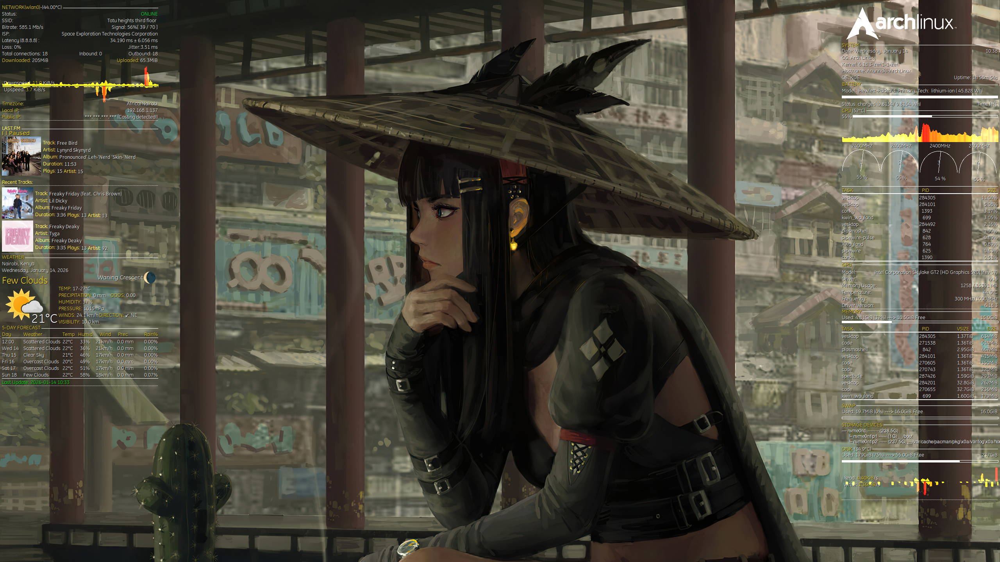
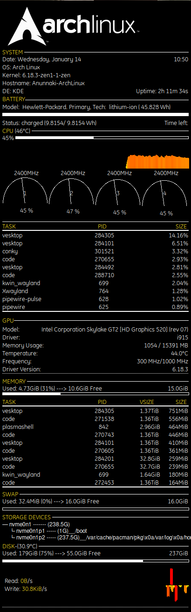
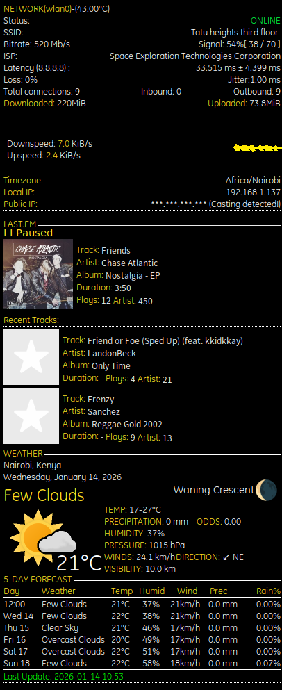

# Conky Themes & Widgets

A collection of modern, beautiful Conky themes and widgets for Linux desktops.


## Available Themes

### Overload - System Monitor





**Features:**

- Multi-core CPU monitoring
- Memory & network statistics  
- Process information
- Clean, modern design
- Zero dependencies beyond Conky

---

### LastFM - Music Display


**Features:**

- Real-time Last.fm integration

- Album artwork display
- Personal play statistics
- Track duration & info
- Fully portable design

---

## Quick Start

### Option 1: Clone Everything

```bash
git clone https://github.com/SethDigerati/conky-themes-repo.git
cd conky-themes-repo
```

### Option 2: Download Individual Themes

```bash
# Just the themes (select specific files under `widgets/` after cloning)
git clone --depth 1 --filter=blob:none --sparse https://github.com/SethDigerati/conky-themes-repo.git
cd conky-themes-repo
git sparse-checkout set widgets
```

### Running Themes

```bash
# System monitor and widget configs
conky -c widgets/cpurc

# Other widgets
conky -c widgets/gpurc
conky -c widgets/networkrc
conky -c widgets/memoryrc
conky -c widgets/weatherrc

# Last.fm (Music)
conky -c widgets/lastfmrc
```

### Last.fm API Credentials

Copy [.env.template](.env.template) to `api.env` (preferred) or `.env`, then set:

- `LASTFM_API_KEY`
- `LASTFM_USERNAME`

Do not commit your credentials.

## Requirements

### Universal Requirements

- **Linux**
- **Conky** (X11-based; on Sway/Wayland you typically run Conky via XWayland)

### Theme-Specific Requirements

| Theme        | Additional Requirements                  |
|--------------|------------------------------------------|
| **Overload** | None                                     |
| **LastFM**   | `curl`, `lua-dkjson`, Last.fm API key    |

### Installation Commands

```bash
# Ubuntu/Debian
sudo apt install conky-all curl lua-dkjson

# Arch Linux
sudo pacman -S conky curl lua-dkjson

# Fedora
sudo dnf install conky curl lua-dkjson
```

## Theme Comparison

| Feature            | Overload          | LastFM        |
|--------------------|-------------------|---------------|
| **Purpose**        | System monitoring | Music display |
| **Complexity**     | Simple            | Moderate      |
| **Dependencies**   | Conky only        | Conky + API   |
| **Network**        | No                | Yes           |
| **Setup Time**     | 2 minutes         | 5 minutes     |
| **Customization**  | High              | High          |
| **Resource Usage** | Minimal           | Minimal       |

## Repository Structure

```text
conky-themes-repo/
├── README.md                
├── LICENSE                  # MIT License
├── .env.template            # API credentials template
├── api.env                  # API credentials (keep untracked/private)
├── lua-configs/             # Lua modules and helpers
│   ├── lastfm.lua
│   ├── network.lua
│   └── weather.lua
├── widgets/                 # Conky RCs and theme configs
│   ├── cpurc
│   ├── gpurc
│   ├── networkrc
│   ├── memoryrc
│   ├── systemrc
│   ├── lastfmrc
│   └── weatherrc
└── assets/                  # Screenshots & resources
    ├── overload_example.png
    ├── example1.png
    ├── example2.png
    └── icons/
```

## License

This project is licensed under the **MIT License** - see the [LICENSE](LICENSE) file for details.

## Acknowledgments

- **[TeejeeTech](http://teejeetech.blogspot.in/)** - Original Overload theme inspiration  
