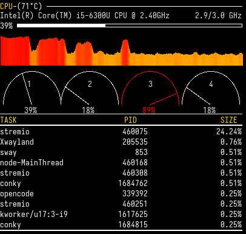
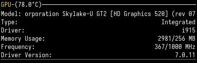
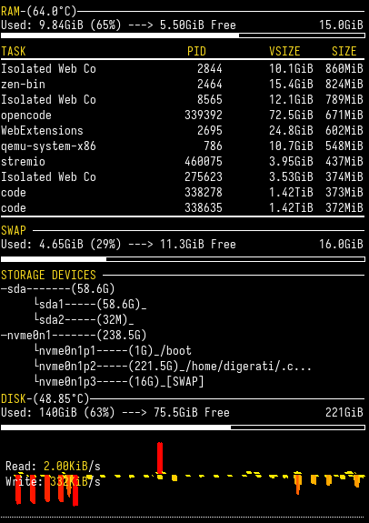
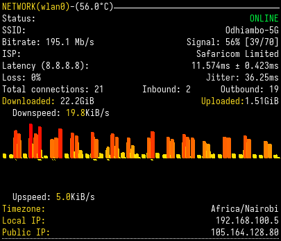
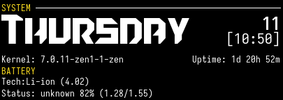
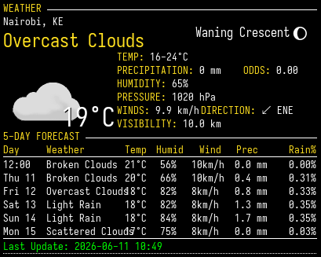
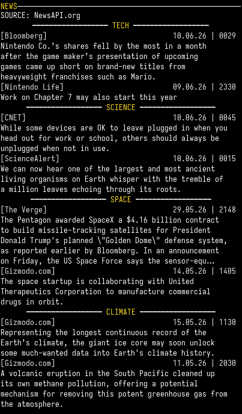
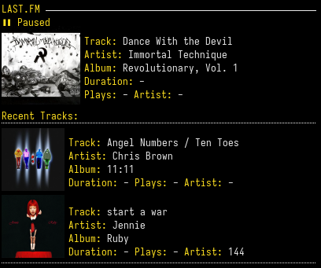
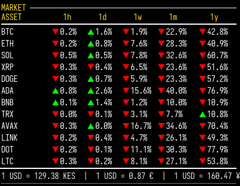
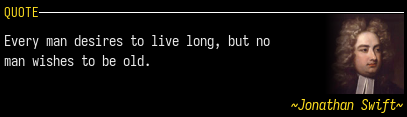

# Conky Themes & Widgets

A collection of modern, beautiful Conky themes and widgets for Linux desktops.


## Available Themes

### Overload - System Monitor

 
 
 

**Features:**

- Multi-core CPU monitoring
- Memory & network statistics  
- Process information
- GPU monitoring
- Clean, modern design
- Zero dependencies beyond Conky

---

### News - Headlines Widget



**Features:**

- 4 categories: TECH, SCIENCE, SPACE, CLIMATE
- Powered by NewsAPI.org
- Background fetching with loading indicator

---

### LastFM - Music Display



**Features:**

- Real-time Last.fm integration
- Album artwork display
- Personal play statistics
- Track duration & info
- Fully portable design

---

### Market - Stock Ticker



**Features:**

- Real-time market data
- Powered by Market API

---

### Quote - Daily Inspiration



**Features:**

- Inspirational quotes
- Random selection

---

## Quick Start

### Option 1: Clone Everything

```bash
git clone https://github.com/SethDigerati/conky-themes-repo.git
cd conky-themes-repo
```

### Option 2: Download Individual Themes

```bash
# Just the themes (select specific files under `widgets/` after cloning)
git clone --depth 1 --filter=blob:none --sparse https://github.com/SethDigerati/conky-themes-repo.git
cd conky-themes-repo
git sparse-checkout set widgets
```

### Running Themes

```bash
# System monitor
conky -c widgets/cpurc
conky -c widgets/gpurc
conky -c widgets/memoryrc
conky -c widgets/networkrc
conky -c widgets/systemrc
conky -c widgets/weatherrc

# News
conky -c widgets/newsrc

# Last.fm (Music)
conky -c widgets/lastfmrc

# Market
conky -c widgets/marketrc

# Quote
conky -c widgets/quoterc
```

### API Credentials

Copy [.env.template](.env.template) to `api.env` (preferred) or `.env`, then set the required keys:

- `LASTFM_API_KEY`, `LASTFM_USERNAME` — for Last.fm widget
- `NEWS_API_KEY` — for News widget

Do not commit your credentials.

## Requirements

### Universal Requirements

- **Linux**
- **Conky** (X11-based; on Sway/Wayland you typically run Conky via XWayland)

### Theme-Specific Requirements

| Theme        | Additional Requirements                  |
|--------------|------------------------------------------|
| **Overload** | None                                     |
| **News**     | `curl`, NewsAPI.org key                  |
| **LastFM**   | `curl`, `lua-dkjson`, Last.fm API key    |
| **Market**   | `curl`, Market API key                   |
| **Quote**    | None                                     |

### Installation Commands

```bash
# Ubuntu/Debian
sudo apt install conky-all curl lua-dkjson

# Arch Linux
sudo pacman -S conky curl lua-dkjson

# Fedora
sudo dnf install conky curl lua-dkjson
```

## Theme Comparison

| Feature            | Overload          | News          | LastFM        | Market       | Quote         |
|--------------------|-------------------|---------------|---------------|--------------|---------------|
| **Purpose**        | System monitoring | News headlines| Music display | Stock data   | Inspiration   |
| **Complexity**     | Simple            | Moderate      | Moderate      | Simple       | Simple        |
| **Dependencies**   | Conky only        | Conky + API   | Conky + API   | Conky + API  | Conky only    |
| **Network**        | No                | Yes           | Yes           | Yes          | No            |
| **Setup Time**     | 2 minutes         | 5 minutes     | 5 minutes     | 5 minutes    | 1 minute      |
| **Customization**  | High              | Medium        | Medium        | Low          | Low           |
| **Resource Usage** | Minimal           | Minimal       | Minimal       | Minimal      | Minimal       |

## Repository Structure

```text
conky-themes-repo/
├── README.md                
├── LICENSE                  # MIT License
├── .env.template            # API credentials template
├── lua-configs/             # Lua modules and helpers
│   ├── data.lua
│   ├── ipinfo.lua
│   ├── lastfm.lua
│   ├── market.lua
│   ├── news.lua
│   ├── quote.lua
│   └── weather.lua
├── widgets/                 # Conky RCs and theme configs
│   ├── cpurc
│   ├── gpurc
│   ├── lastfmrc
│   ├── marketrc
│   ├── memoryrc
│   ├── networkrc
│   ├── newsrc
│   ├── quoterc
│   ├── systemrc
│   └── weatherrc
└── assets/                  # Screenshots & resources
    ├── cpurc.png
    ├── gpurc.png
    ├── lastfmrc.png
    ├── marketrc.png
    ├── memoryrc.png
    ├── networkrc.png
    ├── newsrc.png
    ├── quoterc.png
    ├── systemrc.png
    ├── weatherrc.png
    ├── icons/
    └── Smash Stadium Font.ttf
```

## License

This project is licensed under the **MIT License** - see the [LICENSE](LICENSE) file for details.

## Acknowledgments

- **[TeejeeTech](http://teejeetech.blogspot.in/)** - Original Overload theme inspiration  
