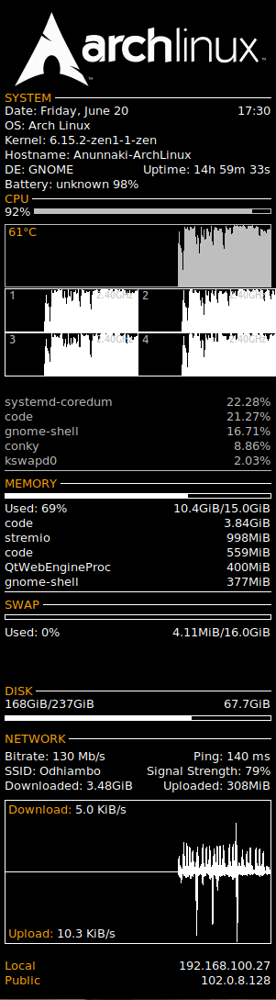
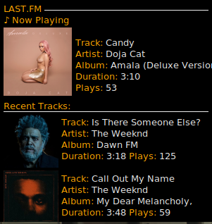

# Conky Themes & Widgets

A collection of modern, beautiful Conky themes and widgets for Linux desktops.


## 🎨 Available Themes

### 📊 Overload - System Monitor


**Features:**
- Multi-core CPU monitoring
- Memory & network statistics  
- Process information
- Clean, modern design
- Zero dependencies beyond Conky

**[📋 View Details & Installation →](overload/README.md)**

---

### 🎵 LastFM - Music Display


**Features:**
- Real-time Last.fm integration
- Album artwork display
- Personal play statistics
- Track duration & info
- Fully portable design

**[📋 View Details & Installation →](lastfm/README.md)**

---

## 🚀 Quick Start

### Option 1: Clone Everything
```bash
git clone https://github.com/SethDigerati/conky-themes-repo.git
cd conky-themes-widgets
```

### Option 2: Download Individual Themes
```bash
# Just the system monitor
git clone --depth 1 --filter=blob:none --sparse https://github.com/SethDigerati/conky-themes-repo.git
cd conky-themes-widgets
git sparse-checkout set overload

# Just the music theme
git sparse-checkout set lastfm
```

### Running Themes
```bash
# System Monitor
cd overload && ./install.sh
conky -c conkyrc

# Music Display  
cd lastfm && ./install.sh
# Configure API credentials, then:
conky -c "lastfm panel"
```

## 📋 Requirements

### Universal Requirements
- **Linux** with X11 window system
- **Conky** system monitor

### Theme-Specific Requirements

| Theme | Additional Requirements |
|-------|------------------------|
| **Overload** | None |
| **LastFM** | `curl`, `lua-dkjson`, Last.fm API key |

### Installation Commands
```bash
# Ubuntu/Debian
sudo apt install conky-all curl lua-dkjson

# Arch Linux
sudo pacman -S conky curl lua-dkjson

# Fedora
sudo dnf install conky curl lua-dkjson
```

## 🎯 Theme Comparison

| Feature | Overload | LastFM |
|---------|----------|--------|
| **Purpose** | System monitoring | Music display |
| **Complexity** | Simple | Moderate |
| **Dependencies** | Conky only | Conky + API |
| **Network** | No | Yes |
| **Setup Time** | 2 minutes | 5 minutes |
| **Customization** | High | High |
| **Resource Usage** | Minimal | Minimal |

## 🛠️ Installation

Each theme includes an automated installation script:

```bash
cd theme-name
./install.sh
```

The scripts will:
- ✅ Check dependencies
- ✅ Create required directories  
- ✅ Set up configuration files
- ✅ Provide next steps

## 🎨 Customization

### Colors
Both themes support easy color customization:

```bash
# Edit theme configuration files
nano overload/conkyrc         # Overload colors
nano lastfm/"lastfm panel"    # LastFM colors
```

### Positioning
```bash
# Common position options
alignment top_left      # Top left corner
alignment top_right     # Top right corner  
alignment bottom_left   # Bottom left corner
alignment bottom_right  # Bottom right corner
```

### Transparency
```bash
# Adjust transparency (0-255)
own_window_argb_value 150   # Semi-transparent
own_window_argb_value 0     # Fully transparent
own_window_argb_value 255   # Opaque
```

## 📁 Repository Structure

```
conky-themes-widgets/
├── 📄 README.md              # This file
├── 📄 LICENSE               # MIT License
├── 📊 overload/             # System monitor theme
│   ├── 📄 README.md         # Overload documentation
│   ├── ⚙️ conkyrc           # Main configuration
│   ├── 🛠️ install.sh        # Installation script
│   └── 📁 assets/           # Screenshots & resources
└── 🎵 lastfm/              # Music theme
    ├── 📄 README.md         # LastFM documentation  
    ├── ⚙️ lastfm panel      # Main configuration
    ├── 🐍 lastfm.lua        # Core logic
    ├── 📋 api_config.lua.template  # API setup
    ├── 🛠️ install.sh        # Installation script
    └── 📁 assets/           # Screenshots & cache
...more

## 🤝 Contributing

Contributions are welcome! Here's how:

1. **Fork** the repository
2. **Create** a feature branch (`git checkout -b feature/amazing-theme`)
3. **Commit** your changes (`git commit -m 'Add amazing theme'`)
4. **Push** to the branch (`git push origin feature/amazing-theme`)
5. **Open** a Pull Request

### Contribution Ideas
- 🎨 New themes
- 🔧 Widget components
- 🐛 Bug fixes
- 📚 Documentation improvements
- 🎯 Performance optimizations

## 📊 Features Roadmap

### Planned Themes
- [ ] 🌡️ Weather widget
- [ ] 📈 Cryptocurrency tracker
- [ ] 🔗 Network monitor ✅
- [ ] 💾 Disk usage analyzer ✅

### Planned Features
- [ ] 🎨 Theme manager script
- [ ] 🔄 Auto-updater


## 📄 License

This project is licensed under the **MIT License** - see the [LICENSE](LICENSE) file for details.

## 🙏 Acknowledgments

- **[Conky Team](https://github.com/brndnmtthws/conky)** - For the amazing system monitor
- **[TeejeeTech](http://teejeetech.blogspot.in/)** - Original Overload theme inspiration  
- **[Last.fm](https://last.fm)** - For the music tracking API
- **Linux Community** - For continuous support and feedback

## 📞 Support

- 🐛 **Bug Reports**: [GitHub Issues](https://github.com/SethDigeraticonky-themes-repo/issues)
- 💬 **Discussions**: [GitHub Discussions](https://github.com/SethDigerati/conky-themes-repo/discussions)
- 📧 **Email**: sethodhiambojad@gmail.com

---

<div align="center">

**⭐ Star this repo if you find it useful! ⭐**

*Made with ❤️ for the Linux community*

</div>
