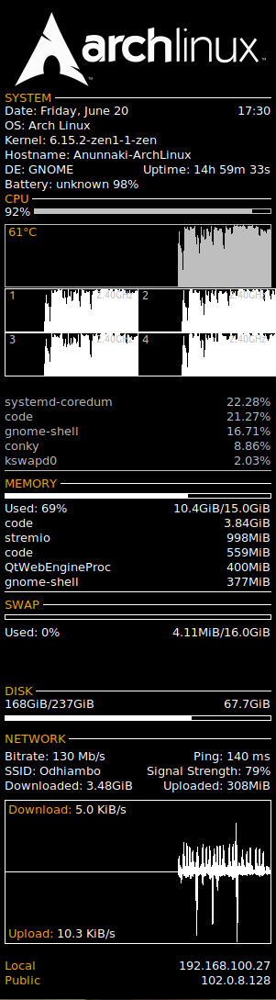

# Overload - System Monitor Conky Theme

A sleek, modern Conky theme for system monitoring with CPU, memory, network, and process information display.



## ✨ Features

- **Multi-Core CPU Monitoring** - Supports 2, 4, 6, and 8-core processors
- **Memory Usage Display** - RAM and swap memory monitoring
- **Network Statistics** - Real-time network upload/download speeds
- **Process Information** - Top processes by CPU and memory usage
- **NVIDIA GPU Support** - GPU temperature and usage (if available)
- **Clean Modern Design** - Minimalist interface with customizable colors
- **Multiple Panel Options** - Separate panels for different system components

## 📸 Screenshot


*Clean system monitoring with CPU, memory, and network information*

## 🚀 Quick Start

### Prerequisites

- **Conky** - System monitor for X11
- **Linux** - Any modern Linux distribution

### Installation

1. **Download the theme:**
   ```bash
   cd ~/.conky
   # Copy the overload folder to your conky directory
   ```

2. **Install dependencies:**
   ```bash
   sudo apt install conky-all  # Ubuntu/Debian
   sudo pacman -S conky        # Arch Linux
   sudo dnf install conky      # Fedora
   ```

3. **Run the theme:**
   ```bash
   conky -c ~/.conky/overload/conkyrc
   ```

## ⚙️ Configuration

### Theme Customization

Edit the `conkyrc` file to customize:

- **Position**: Change `alignment` (top_left, top_right, bottom_left, bottom_right)
- **Size**: Modify `minimum_size` and `maximum_width`
- **Colors**: Update color values in the TEXT section
- **Update Interval**: Adjust `update_interval` (in seconds)
- **Transparency**: Modify `own_window_argb_value`

### CPU Core Configuration

The theme automatically detects your CPU cores, but you can manually adjust:

```bash
# For different core counts, edit the CPU section in conkyrc
${cpu cpu1} ${cpu cpu2} ${cpu cpu3} ${cpu cpu4}  # 4-core example
```

## 📁 File Structure

```
overload/
├── conkyrc              # Main Conky configuration
├── dependencies.txt     # Required packages
├── install.sh          # Installation script
├── source.txt          # Theme source information
├── LICENSE             # License file
└── assets/
    ├── archlinux-logo.png    # Logo asset
    └── overload_example.png  # Theme screenshot
```

## 🔧 Technical Details

### System Information Displayed

- **CPU Usage** - Per-core and overall usage percentages
- **Memory** - RAM usage, buffers, cache, and swap
- **Network** - Upload/download speeds and total transferred
- **Processes** - Top CPU and memory consuming processes
- **System** - Uptime, load average, and system information
- **Storage** - Disk usage for mounted filesystems

### Performance Impact

- **RAM Usage**: ~5-10MB
- **CPU Impact**: Minimal (configurable update interval)
- **Refresh Rate**: 1-5 seconds (customizable)

## 🎨 Customization Examples

### Color Schemes

**Dark Theme** (default):
```bash
default_color white
color1 EAEAEA
color2 FFA300
```

**Light Theme**:
```bash
default_color black
color1 333333
color2 0066CC
```

### Position Options

**Top Right** (default):
```bash
alignment top_right
gap_x 0
gap_y 5
```

**Bottom Left**:
```bash
alignment bottom_left
gap_x 20
gap_y 20
```

## 🐛 Troubleshooting

### Common Issues

**Conky not starting:**
```bash
# Check Conky installation
which conky

# Test configuration
conky -c conkyrc -d
```

**Display issues:**
```bash
# Check X11 display
echo $DISPLAY

# Verify window manager compatibility
wmctrl -l
```

**Performance problems:**
```bash
# Increase update interval in conkyrc
update_interval 3  # Update every 3 seconds instead of 1
```

## 📊 System Requirements

- **OS**: Linux with X11
- **RAM**: 5-10MB additional usage
- **CPU**: Minimal impact
- **Display**: X11 compatible window manager

## 🤝 Contributing

Contributions are welcome! Areas for improvement:

- Additional color schemes
- New layout options
- Hardware sensor support
- Window manager specific optimizations

## 📄 License

This project is licensed under the MIT License - see the LICENSE file for details.

## 🙏 Acknowledgments

- **TeejeeTech** - Original theme inspiration
- **Conky Community** - For the excellent system monitoring framework
- **Linux Community** - For continuous support and feedback

---

*A clean, efficient system monitor for your Linux desktop*
